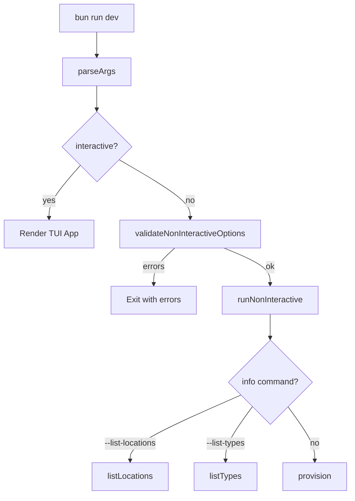
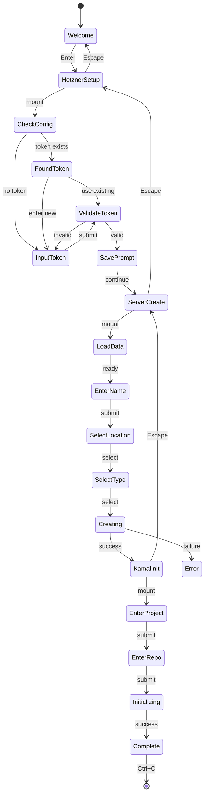
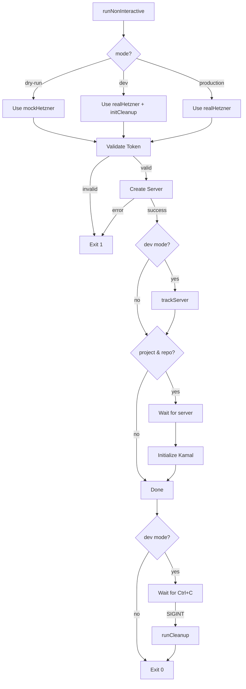
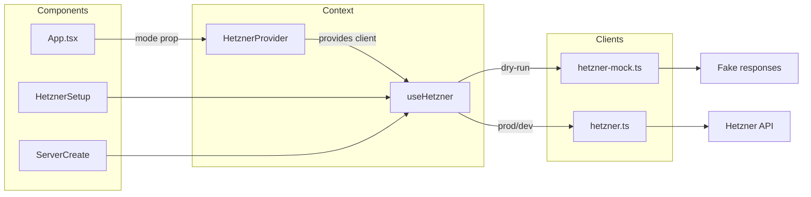
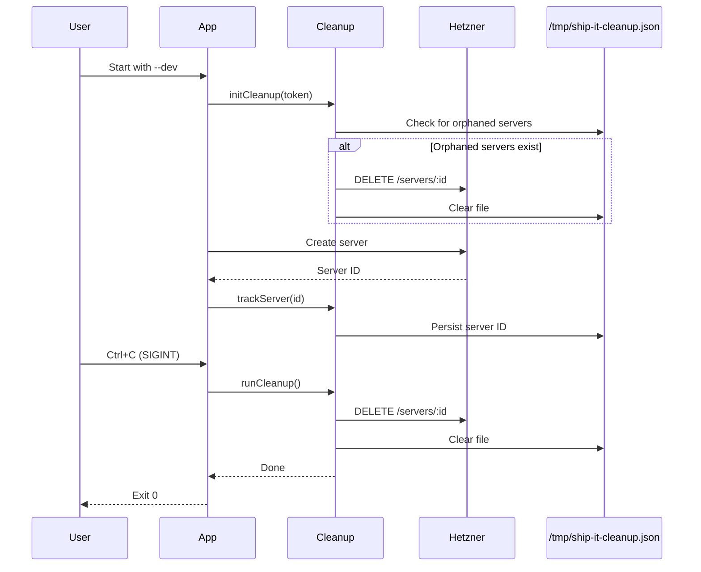
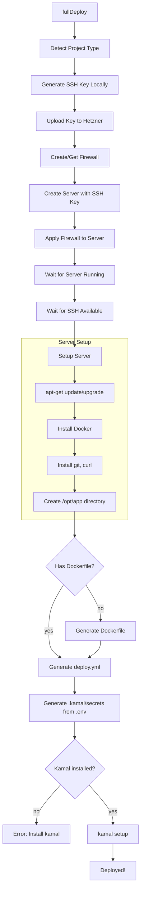
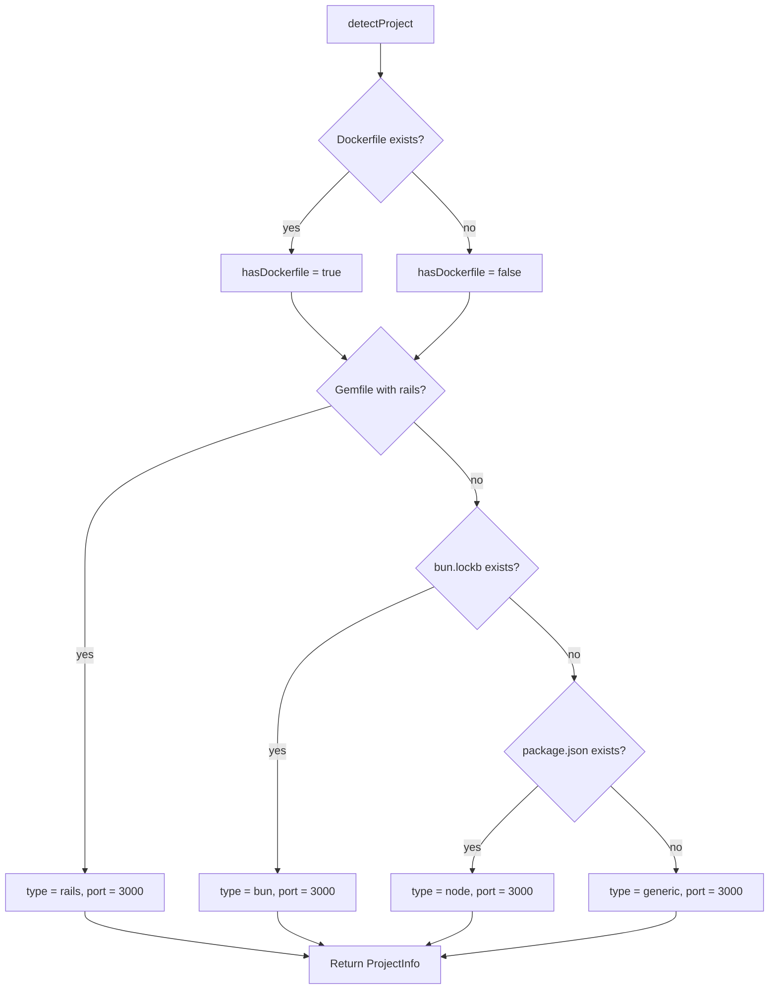
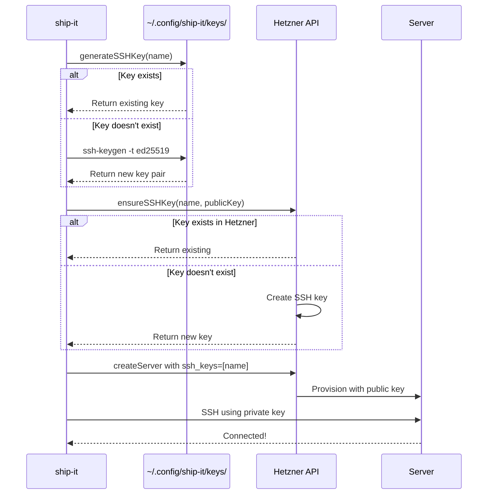
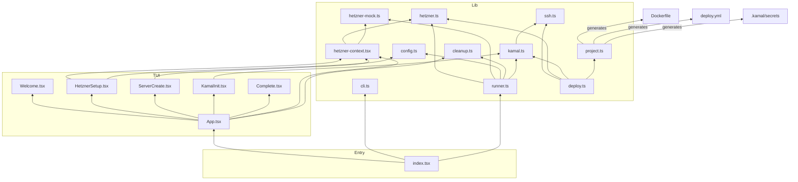

# Architecture

## Entry Point Flow

## TUI Wizard Flow

## Non-Interactive Provisioning Flow

## Hetzner Client Architecture

## Dev Mode Cleanup Flow

## Full Deploy Orchestration (deploy.ts)

## Project Detection Flow

## SSH Key Flow

## File Dependencies

